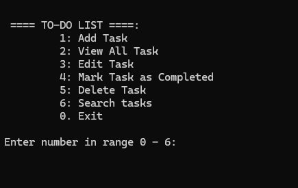
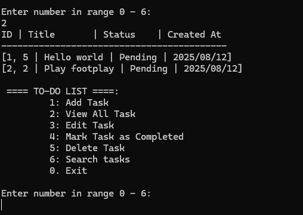

# To-Do List Console Application

A simple and efficient **To-Do List** console application written in C#.  
Manage your daily tasks easily with features like add, edit, delete, mark completed, search, and persistent storage.

---

## Features

- Add new tasks with title and description
- View all tasks with status and creation date
- Edit existing tasks
- Mark tasks as completed
- Delete tasks
- Search tasks by keyword (title or description)
- Persistent task storage using JSON file (`tasks.json`)
- Clean and user-friendly console interface

---

## Getting Started

### Prerequisites

- [.NET 6 SDK](https://dotnet.microsoft.com/en-us/download) or later installed on your machine

### Build & Run

1. Clone the repository:
    ```bash
    git clone https://github.com/your-username/todo-list-console-app.git
    ```
2. Navigate to the project directory:
    ```bash
    cd todo-list-console-app
    ```
3. Build the project:
    ```bash
    dotnet build
    ```
4. Run the application:
    ```bash
    dotnet run --project ToDoListConsoleApp.csproj
    ```

---

## Usage

Upon running, a menu is displayed with options:



## Database 
task.json 

```bash
{
  "1": {
    "Id": 1,
    "Title": "Hello world",
    "Description": "welcome this in the universe",
    "IsCompleted": false,
    "CreatedAt": "2025-08-12T19:10:57.9582023+01:00",
    "CompletedAt": null
  },
  "2": {
    "Id": 2,
    "Title": "Play footplay",
    "Description": "Play with my frindes at 4pm",
    "IsCompleted": true,
    "CreatedAt": "2025-08-12T19:14:25.1982764+01:00",
    "CompletedAt": "2025-08-12T19:14:57.4556922+01:00"
  }
}

```
## License

This project is licensed under the MIT License. See the [LICENSE](LICENSE) file for details.